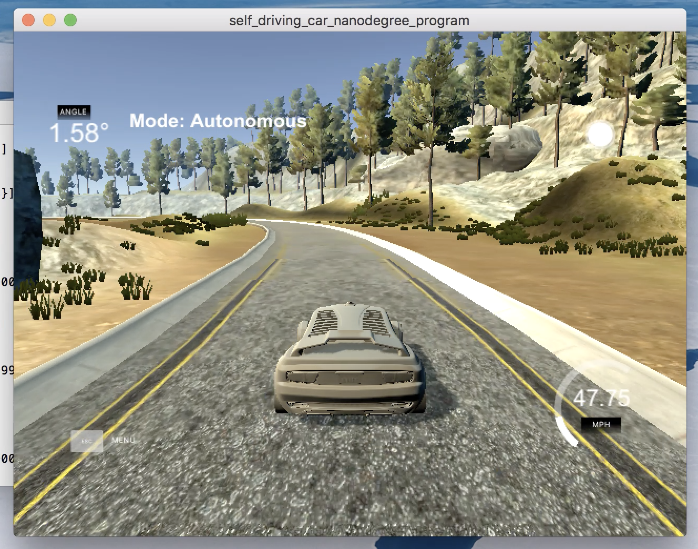

# CarND-PID-Control-Project

## Describe the effect each of the P, I, D components had in your implementation.

I have two PID controllers in my implementation. One controls the steering angle; the other controls the speed. 

The proportional term `P` in my steer controller produces an output steering angle proportional to the current CTE (cross track error) value `p_error`. Higher `P` results in more pronounced change in the steering angle. Seen on the track, the car may correct itself drastically even when it is a little off-center. This results in the car driving off the road very quickly, especially when the speed is high. When the car drives at an average speed of 50 mph, `P` at 0.2 seems to work very well.  

The integral term `I` is proportional to `i_error`, which is the sum of all the previous CTEs. It corrects for the systematic error of the controller and elimanates any bias that the controller may develop over time. The car seems to drive equally well when `I` is set to zero or very small values like 1e-6. 

The derivative term `D` is proportional to `d_error`, which is the change of CTE from time to time. It prevents the car from overshooting the reference when making steering angle adjustments. A high `D` value results in swift recovery from off-center. This really helps when the car needs to go at a higher speed because it makes the car react faster without overshooting. 

## Describe how the final hyperparameters were chosen.

The final hyperparameters [Kp, Ki, Kd] chosen for the steer control are [0.2, 1e-6, 4.0] and [0.2, 0.0, 2.0] for the speed control. They were mostly chosen by hand but Twiddle was implemented to refine them in real time.  

The code in C++ is adapted from the Python code given in class where tolerance was set to 1e-3.  

```
def twiddle(tol=0.2): 
    p = [0, 0, 0]
    dp = [1, 1, 1]
    robot = make_robot()
    x_trajectory, y_trajectory, best_err = run(robot, p)

    it = 0
    while sum(dp) > tol:
        print("Iteration {}, best error = {}".format(it, best_err))
        for i in range(len(p)):
            p[i] += dp[i]
            robot = make_robot()
            x_trajectory, y_trajectory, err = run(robot, p)

            if err < best_err:
                best_err = err
                dp[i] *= 1.1
            else:
                p[i] -= 2 * dp[i]
                robot = make_robot()
                x_trajectory, y_trajectory, err = run(robot, p)

                if err < best_err:
                    best_err = err
                    dp[i] *= 1.1
                else:
                    p[i] += dp[i]
                    dp[i] *= 0.9
        it += 1
    return p
```
## Project Video

[](https://youtu.be/EHFHzK1hJJE)
